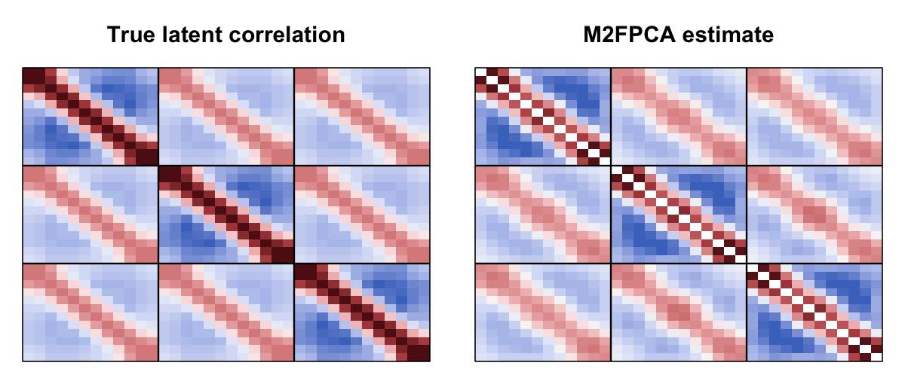
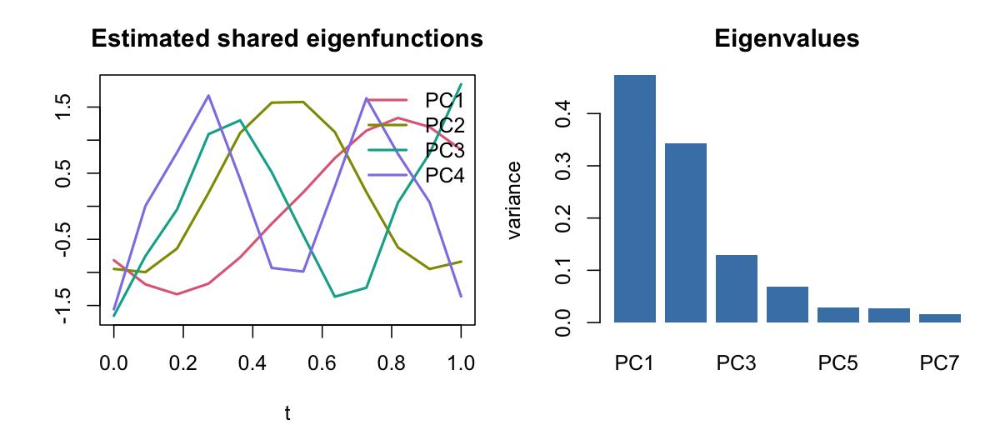

<!-- README.md is generated from README.Rmd. Edit the .Rmd, then run rmarkdown::render("README.Rmd"). -->

# M2FPCA

<!-- badges: start -->

[](https://www.gnu.org/licenses/gpl-3.0)
<!-- badges: end -->

> **Multivariate Functional Principal Component Analysis for Mixed-Type
> Functional Data (M²FPCA).** Joint covariance estimation and FPCA for
> several functional variables of *different* types — continuous,
> truncated, ordinal, binary — measured over a common domain.

## The problem

Studies like mobile-health (mHealth) record several signals over time
for each subject, on *different measurement scales*: continuous
accelerometer activity, a binary “did you exercise?” indicator, an
ordinal mood rating (0–4), a zero-inflated (truncated) symptom count.
Standard multivariate FPCA assumes all curves are Gaussian/continuous,
which none of these are. We want one joint model that

1.  estimates how each variable **co-varies over time** (marginal
    covariance), and
2.  estimates how the variables **co-vary with each other** across time
    (cross-covariance), and
3.  produces interpretable **shared temporal modes** and **subject
    scores** that borrow strength across variables.

## How M²FPCA works

M²FPCA places a **latent Gaussian copula** under the observed data: each
observed curve `X_v(t)` is a monotone (type-specific) transform of a
latent Gaussian process `Z_v(t)`. Because Kendall’s τ is invariant to
monotone transforms, the *latent* correlations are identified from the
observed data through type-specific **bridging functions** — even for
binary/ordinal/truncated margins.

The estimator (`mpfpca.dir`) has three stages:

1.  **Marginal surfaces.** Each variable’s latent covariance surface
    `C_vv(s,t)` is estimated with the single-variable SGC estimator
    (`SGCTools::fpca.sgc.lat`).
2.  **Cross surfaces.** For every pair, the latent cross-covariance
    `C_jk(s,t)` is estimated by fitting a tensor-product spline to the
    *bridged* Kendall’s τ surface, using the correct cross-type bridge
    (`pfpca_crosscov`).
3.  **Partial separability.** The variables are assumed to share a
    common temporal eigenbasis `{φ_ℓ(t)}` (estimated from the averaged
    marginal covariance). Cross-variable dependence is then summarised
    by small `p × p` score-covariance matrices `S_ℓ`, one per component
    — a compact, interpretable multivariate Karhunen–Loève
    representation.

This works for **regular** grids and **irregular / sparse /
asynchronous** sampling (the `min_no_pairs` cutoff drops time-point
pairs with too few co-observations before fitting).

## Installation

``` r
# install.packages("remotes")
# SGCTools is pulled automatically from GitHub via the Remotes: field.
remotes::install_github("Ddey07/M2FPCA")
```

## Worked example: recovering a known truth

We simulate `p = 3` variables — **continuous**, **binary**, **ordinal**
— sharing a partially separable latent structure, then check that M²FPCA
recovers the truth from the mixed-type observations.

``` r
library(M2FPCA)
set.seed(1)

n <- 300; m <- 12; p <- 3
argvals <- seq(0, 1, length = m)

# shared temporal modes (cosine: nonzero at the endpoints) and their variances
Lc     <- 4
phi    <- sapply(1:Lc, function(l) sqrt(2) * cos(l * pi * argvals))   # m x Lc
lambda <- c(1, 0.6, 0.3, 0.15)

# cross-variable correlation of the component scores (0.5 off-diagonal)
Rcross <- matrix(0.5, p, p); diag(Rcross) <- 1

# latent process V_v(t) = sum_l theta_{v,l} phi_l(t),  theta_l ~ N_p(0, lambda_l Rcross)
V <- array(0, c(n, m, p))
for (l in 1:Lc) {
  th <- mvtnorm::rmvnorm(n, sigma = lambda[l] * Rcross)
  for (v in 1:p) V[, , v] <- V[, , v] + outer(th[, v], phi[, l])
}

# observe each variable on its own scale (continuous / binary / ordinal)
zcol <- function(M) apply(M, 2, function(x) (x - mean(x)) / sd(x))
dat_list <- list(
  activity = V[, , 1],                                                   # continuous
  exercise = (zcol(V[, , 2]) > 0) * 1,                                   # binary
  mood     = apply(zcol(V[, , 3]), 2, function(x)                        # ordinal 0/1/2
                   as.numeric(cut(x, c(-Inf, -0.6, 0.6, Inf))) - 1)
)
type <- c("cont", "bin", "ord")
```

Fit M²FPCA:

``` r
fit <- mpfpca.dir(dat_list, type = type, argvals = argvals, df = 5, weights = TRUE)
fit$L                       # number of shared components retained
#> [1] 7
```

### Marginal and cross covariance: estimate vs truth

The latent target is a correlation surface. Analytically the true full
latent correlation is `Rcross %x% cov2cor(K)` with
`K = sum_l lambda_l phi_l phi_l'`.

``` r
K_true <- Reduce("+", lapply(1:Lc, function(l) lambda[l] * outer(phi[, l], phi[, l])))
RK     <- cov2cor(K_true)                 # true shared temporal correlation (m x m)
R_true <- kronecker(Rcross, RK)           # true (mp x mp) latent correlation
R_hat  <- cov.from.mpfpca.dir(fit)        # estimated (mp x mp) latent correlation
```

``` r
heat <- function(M, main, zlim = c(-1, 1)) {
  pal <- hcl.colors(64, "Blue-Red 3")
  image(1:nrow(M), 1:ncol(M), M[, ncol(M):1], col = pal, zlim = zlim,
        axes = FALSE, xlab = "", ylab = "", main = main); box()
  # bold separators between the p variable-blocks
  ab <- (1:(p - 1)) * m + 0.5
  abline(v = ab, h = nrow(M) - ab + 1, lwd = 1.5)
}
par(mfrow = c(1, 2), mar = c(1, 1, 3, 1))
heat(R_true, "True latent correlation")
heat(R_hat,  "M2FPCA estimate")
```



``` r
cat(sprintf("relative Frobenius error: %.3f\n", norm(R_hat - R_true, "F") / norm(R_true, "F")))
#> relative Frobenius error: 0.182
```

Each `m × m` block is one variable pair: the three diagonal blocks are
the marginal correlation surfaces, the off-diagonal blocks the
cross-correlations. M²FPCA recovers all of them from continuous +
binary + ordinal data.

### Shared temporal eigenfunctions

``` r
Phi <- fit$pfpca_results[[1]]$phi          # shared eigenfunctions (m x L)
cols <- hcl.colors(4, "Dark 3")
par(mfrow = c(1, 2), mar = c(4, 4, 3, 1))
matplot(argvals, Phi[, 1:4], type = "l", lwd = 2, lty = 1, col = cols,
        xlab = "t", ylab = "", main = "Estimated shared eigenfunctions")
legend("topright", paste0("PC", 1:4), col = cols, lwd = 2, bty = "n")
barplot(fit$pfpca_results[[1]]$lambda, col = "steelblue", border = NA,
        names.arg = paste0("PC", seq_along(fit$pfpca_results[[1]]$lambda)),
        main = "Eigenvalues", ylab = "variance")
```



### Cross-variable scores

Subject scores from `mpfpca_scores` recover the cross-variable
correlation structure (true off-diagonal = 0.5):

``` r
sc <- mpfpca_scores(dat_list, type, fit, argvals, npc = 3)
round(cor(sc$scores[[1]]), 2)             # p x p score correlation, component 1
#>        V1_PC1 V2_PC1 V3_PC1
#> V1_PC1   1.00   0.43   0.46
#> V2_PC1   0.43   1.00   0.40
#> V3_PC1   0.46   0.40   1.00
```

## Irregular / sparse sampling

Pass data with `NA`s; `min_no_pairs` controls the reliability cutoff
(time-point pairs with fewer co-observations are dropped before
fitting):

``` r
dat_miss <- lapply(dat_list, function(X) { X[sample(length(X), 0.2 * length(X))] <- NA; X })
fit_irr  <- mpfpca.dir(dat_miss, type = type, argvals = argvals, df = 5, min_no_pairs = 20)
fit_irr$L
#> [1] 7
```

## Function reference

| Function | Purpose |
|------------------------------------|------------------------------------|
| `mpfpca.dir` | Joint M²FPCA estimator → marginal + cross covariance, shared eigenbasis, `S` |
| `pfpca_crosscov` | Cross-covariance surface between two mixed-type variables |
| `cov.from.mpfpca.dir` | Reconstruct the full `(mp × mp)` latent covariance from a fit |
| `mpfpca_scores` | Subject multivariate FPC scores (latent prediction + projection) |
| `mpfpca` | ps-M²FPCA variant (two-stage; needs `fgm`) |
| `sigma_from_fpca` | Covariance implied by a partially separable FPCA object |

`mpfpca.dir()` returns: `pfpca_results` (per-variable
`lambda`/`phi`/`cumFVE`), `S` (per-component `p × p` score covariances),
`L`, `raw_est` (raw block covariance), `raw_est_cov` (its delta-method
variance), and `cov_marginal`.

## Reference

Dey, D., Ghosal, R., Merikangas, K., & Zipunnikov, V. (2024).
*Functional Principal Component Analysis for Continuous Non-Gaussian,
Truncated, and Discrete Functional Data.* **Statistics in Medicine**,
43, 5431–5445.
[doi:10.1002/sim.10240](https://doi.org/10.1002/sim.10240)

See [`BUILD_NOTES.md`](BUILD_NOTES.md) for how the package was assembled
and validated against the original research code (including the fgm
fidelity check).
